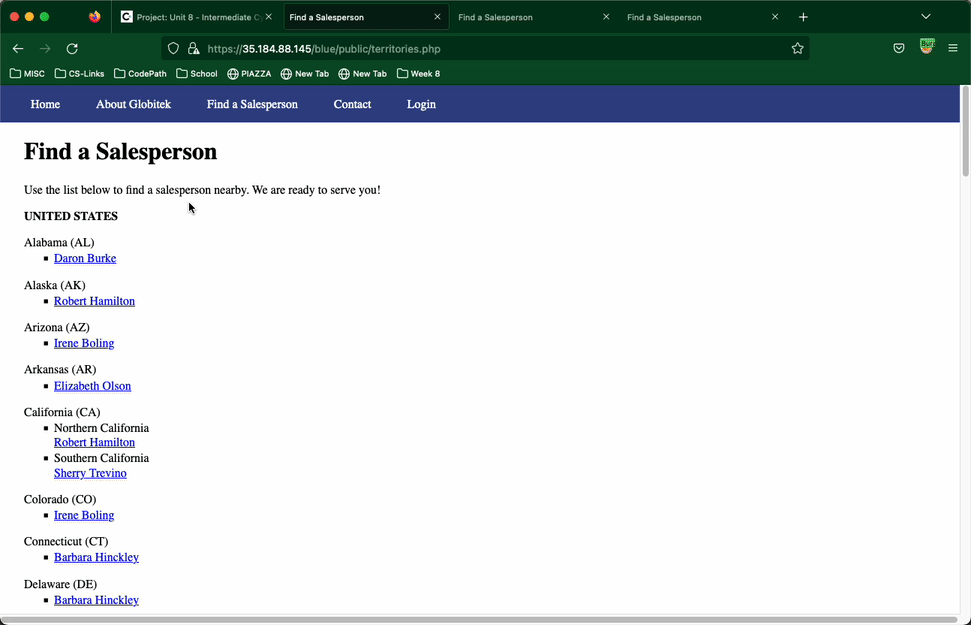
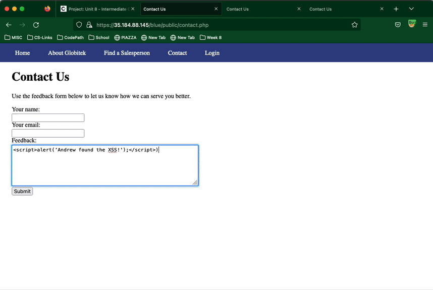
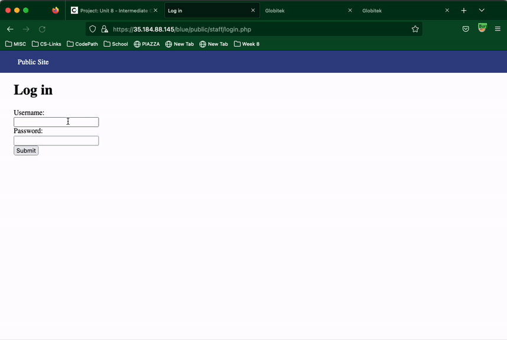
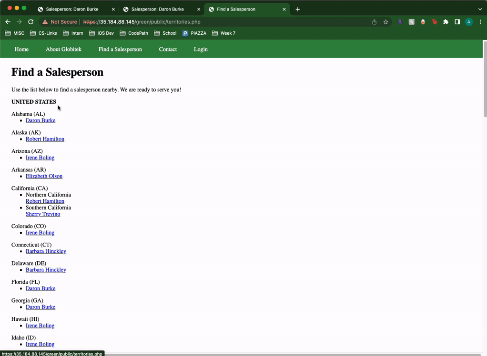

# Pen Testing Live Targets

Time spent: 8 hours spent in total

> Objective: Identify vulnerabilities in three different versions of the Globitek website: blue, green, and red.

The six possible exploits are:

* Username Enumeration
* Insecure Direct Object Reference (IDOR)
* SQL Injection (SQLi)
* Cross-Site Scripting (XSS)
* Cross-Site Request Forgery (CSRF)
* Session Hijacking/Fixation

Each color is vulnerable to only 2 of the 6 possible exploits. First discover which color has the specific vulnerability, then write a short description of how to exploit it, and finally demonstrate it using screenshots compiled into a GIF.

## RED

Vulnerability #1: Insecure Direct Object Reference

Description: 
1) Under the "Find a Salesperson" section, upon clicking a name, we can see "https://35.184.88.145/blue/public/salesperson.php?id=1" as the URL.
2) We use brute force to change the "id= " part of the URL.
3) When trying using "...id=11" (i.e. "https://35.184.88.145/blue/public/salesperson.php?id=11"), we find that the RED site has an IDOR vulnerability.
4) We are able to view a salesperson: "Lazy Lazyman(FIRED FOR STEALING)".

## Green

Vulnerability #2: Cross-Site Scripting (XSS)

Description:
1) Under the "Contact" section, we can find a feedback form that we can exploit by injecting javascript.
2) In the Name and Feedback fields, we can enter 
3) After logging into the site using given credentials, we navigate to the MENU, then Feedback.
4) Upon clicking the Feedback button, the script alert is shown in the GREEN site..

## Green

Vulnerability #3: User Enumeration

Description:
1) When clicking the Login section, the Username and Password fields are shown.
2) When we enter a fake username (i.e. "hello") and password, an error displays: "Please fix the following errors: Log in was unsuccessful".
3) When entering a valid username (i.e. "jmonroe99" and incorrect password, the same error displays. However, it is in BOLD font indicating that the user may exist. 
4) This only occurs in the GREEN site.

## BLUE

Vulnerability #4: SQL Injection (SQLI)

Description:
1) When clicking the Find a Salesperson section and selecting a person, we can see an id parameter in the URL: 
  (i.e. https://35.184.88.145/blue/public/salesperson.php?id=1)
2) By injecting SQL code such as: %27%20OR%20SLEEP(5)=0--%27, it will cause the site to wait for 5 seconds before finally loading the page.
3) This only occurs in the BLUE site. The other sites appear to sanitize the data and just reload the Find a Salesperson page.

## Notes

Describe any challenges encountered while doing the work

