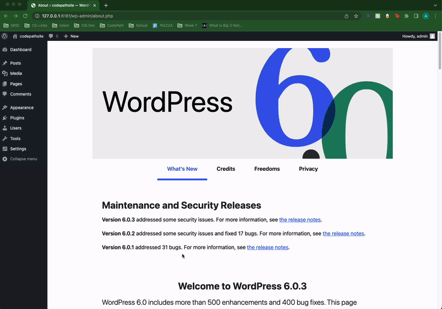
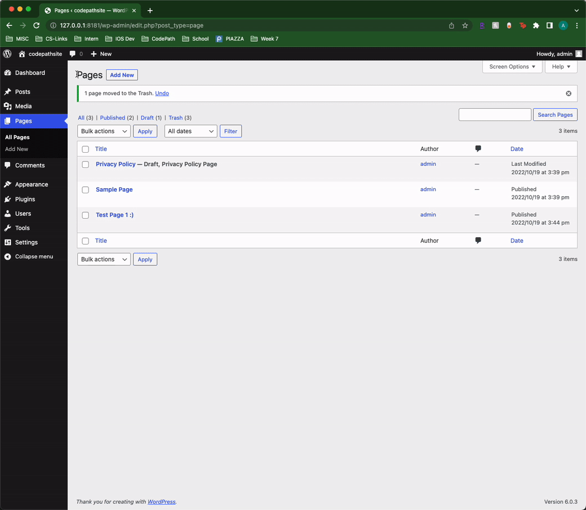
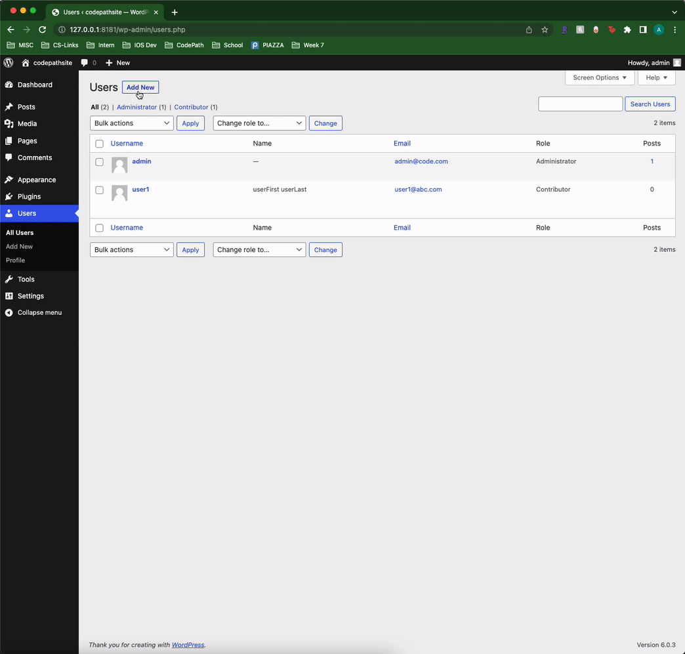

# Project 7 - WordPress Pen Testing  ***DOCKER VERSION***

Time spent: 6 hours spent in total

> Objective: Find, analyze, recreate, and document **five vulnerabilities** affecting an old version of WordPress

## Pen Testing Report

### 1. (Required) Vulnerability Name or ID: Cross-Site Scripting (XSS)

- [ ] Summary: 
  - Vulnerability types: XSS
  - Tested in version: WordPress 6.0.3
  - Fixed in version: - (latest version)
- [ ] GIF Walkthrough: 

- [ ] Steps to recreate: 
  - 1) Create a new post
  - 2) Use "Custom HTML" under widgets
  - 3) Add the following code into the post: 
            <a href="</a><a title=" onmouseover="alert('HACKER ALERT!!!!XSS!!!')" "="">link</a>
- [ ] Affected source code:
  [Link 1](http://127.0.0.1:8181/wp-admin/post.php?post=18&action=edit)
  
  
### 2. (Required) Vulnerability Name or ID: Cross-Site Scripting (XSS)

- [ ] Summary: 
  - Vulnerability types: XSS
  - Tested in version: WordPress 6.0.3
  - Fixed in version: - (latest version)
- [ ] GIF Walkthrough: 

- [ ] Steps to recreate: 
 - 1) Create a new page
 - 2) Inject script as a mouse-over button into heading/title of page disguised as a letter of title.
 - 3) Add the following code into the post: 
          <input type="BUTTON" onmouseover="alert('HELLO I AM TRYING TO REACH YOU ABOUT YOUR CARS OVERDUE EXTENDED WARRANTY PAYMENT. PLEASE CALL XXX-   XXX-XXXX WITH YOUR CREDIT CARD INFORMATION.')">
- [ ] Affected source code:
  [Link 1](http://127.0.0.1:8181/wp-admin/post.php?post=18&action=edit)
 

### 3. (Required) Vulnerability Name or ID: User Enumeration

- [ ] Summary: 
  - Vulnerability types: User Enumeration
  - Tested in version: 6.0.3 
  - Fixed in version: - (latest version)
- [ ] GIF Walkthrough: 

- [ ] Steps to recreate: 
 - 1) Log in as administrator
 - 2) Click Users on sidebar --> Add New
 - 3) Enter username, email, first/last name, and password
 - 4) Log out
 - 5) Enter an existing username in users list and attempt a incorrect password
 - 6) You should be able to view an error message confirming that the user exists:
          "Error: The password you entered for the username admin is incorrect. Lost your password?"
- [ ] Affected source code:
  - [Link 1](http://127.0.0.1:8181/wp-login.php)

### 4. (Optional) Vulnerability Name or ID

- [ ] Summary: 
  - Vulnerability types:
  - Tested in version:
  - Fixed in version: 
- [ ] GIF Walkthrough: 
- [ ] Steps to recreate: 
- [ ] Affected source code:
  - [Link 1](https://core.trac.wordpress.org/browser/tags/version/src/source_file.php)

  
  
### 5. (Optional) Vulnerability Name or ID

- [ ] Summary: 
  - Vulnerability types:
  - Tested in version:
  - Fixed in version: 
- [ ] GIF Walkthrough: 
- [ ] Steps to recreate: 
- [ ] Affected source code:
  - [Link 1](https://core.trac.wordpress.org/browser/tags/version/src/source_file.php) 

## Assets

List any additional assets, such as scripts or files

## Resources

- [WordPress Source Browser](https://core.trac.wordpress.org/browser/)
- [WordPress Developer Reference](https://developer.wordpress.org/reference/)

GIFs created with ... https://getkap.co/
<!-- Recommended GIF Tools:
[Kap](https://getkap.co/) for macOS
[ScreenToGif](https://www.screentogif.com/) for Windows
[peek](https://github.com/phw/peek) for Linux. -->

## Notes

Describe any challenges encountered while doing the work

## License

    Copyright [yyyy] [name of copyright owner]

    Licensed under the Apache License, Version 2.0 (the "License");
    you may not use this file except in compliance with the License.
    You may obtain a copy of the License at

        http://www.apache.org/licenses/LICENSE-2.0

    Unless required by applicable law or agreed to in writing, software
    distributed under the License is distributed on an "AS IS" BASIS,
    WITHOUT WARRANTIES OR CONDITIONS OF ANY KIND, either express or implied.
    See the License for the specific language governing permissions and
    limitations under the License.
