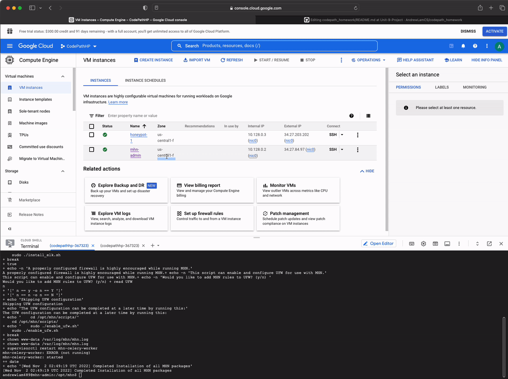
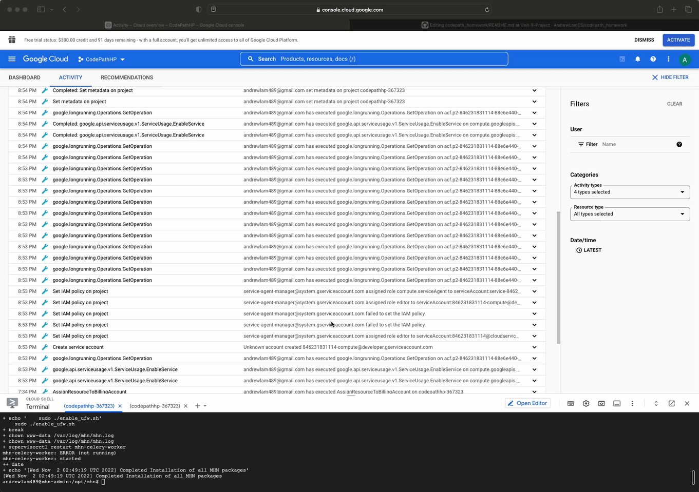
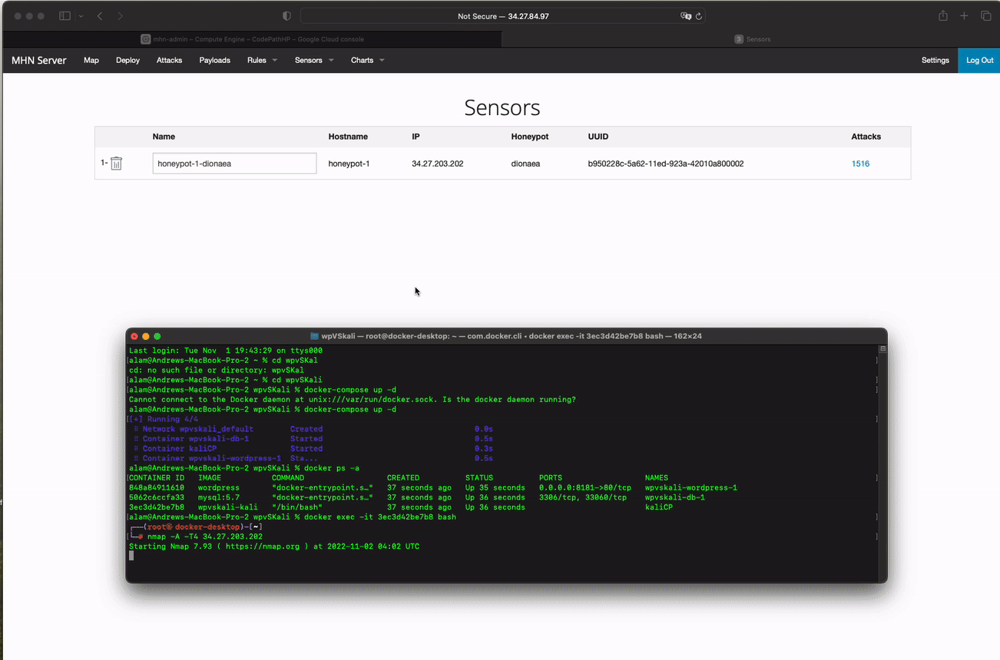
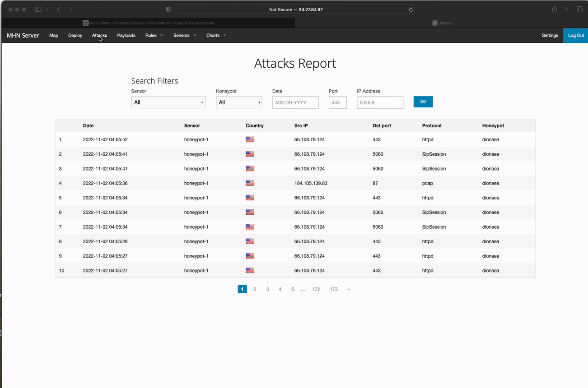
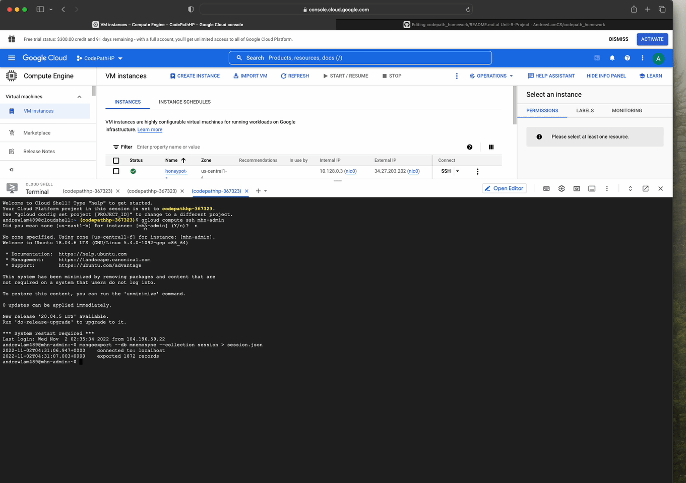
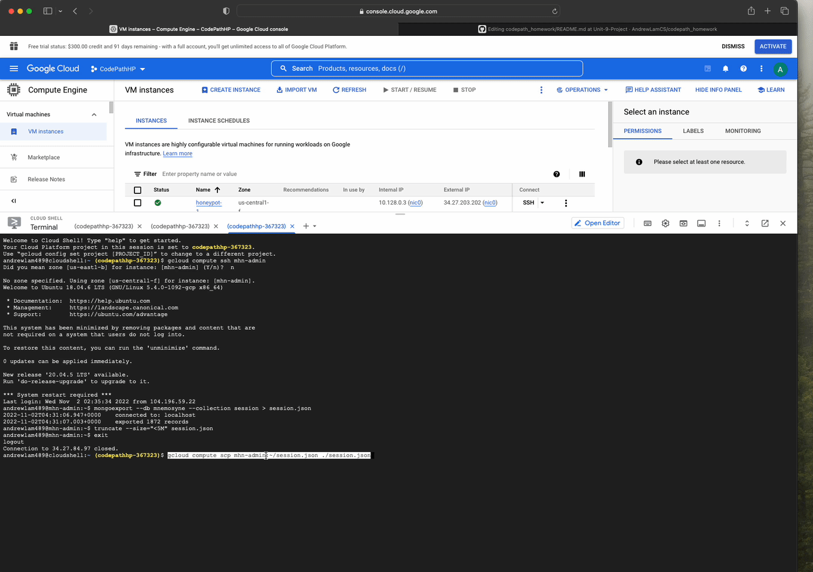
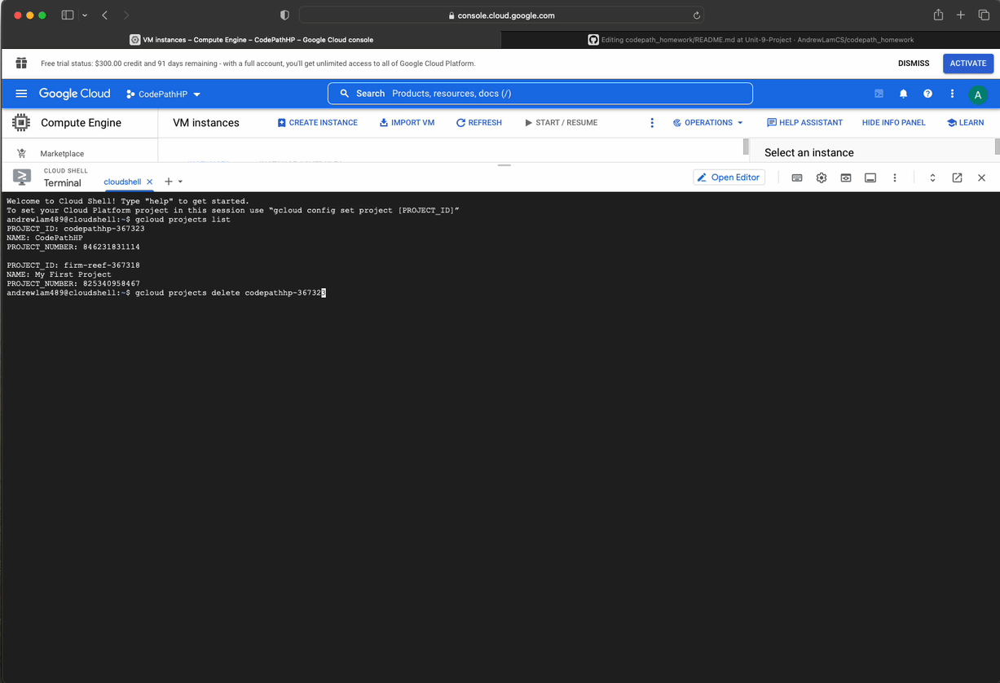

# Honeypot Assignment

**Time spent:** **2** hours spent in total

**Objective:** Create a honeynet using MHN-Admin. Present your findings as if you were requested to give a brief report of the current state of Internet security. Assume that your audience is a current employer who is questioning why the company should allocate anymore resources to the IT security team.

### MHN-Admin Deployment (Required)

**Summary:** How did you deploy it? Did you use GCP, AWS, Azure, Vagrant, VirtualBox, etc.?
  
   Using Google Cloud Platform's Free Tier, we created accounts, installed GCP SDK and initialized it using gcloud commands. 

### Dionaea Honeypot Deployment (Required)

**Summary:** Briefly in your own words, what does dionaea do?

  Dionaea is a honeypot deployment that we used to track attacks from all over the globe. 
  

### Database Backup (Required) 

**Summary:** What is the RDBMS that MHN-Admin uses? What information does the exported JSON file record?

  The RDBMS that MHN-Admin uses is MongoDB. The exported JSON file record displays a database of the attacks.
  
  
  

*Be sure to upload session.json directly to this GitHub repo/branch in order to get full credit.*

### Deploying Additional Honeypot(s) (Optional)

#### X Honeypot

**Summary:** What does this honeypot simulate and do for a security researcher?

### Malware Capture and Identification (Optional)

#### X Malware

**Summary:** How did you find it? Which honeypot captured it? What does each malware do?

MD5 Hash: *Run `md5sum` on the file and record the hash here.*

SHA1 Hash: *Run `sha1sum` on the file and record the hash here.*

## Notes

Describe any challenges encountered while doing the assignment.

The region and zone settings were not being saved. I used the following command to unset metadata: 

gcloud compute project-info remove-metadata \
   --keys=google-compute-default-region,google-compute-default-zone
   
It then prompts the user for region/zone, where you can then select it from a list.
